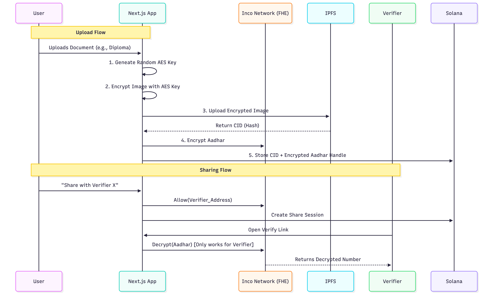

# 🔐 PrivyLocker
### Privacy-Preserving Document Verification on Solana + Inco Lightning


[](https://privylocker.netlify.app/)

**PrivyLocker** is a decentralized application (dApp), built on Solana, that allows users to securely store sensitive personal documents (like National IDs, Degrees) and share *verifiable proofs* of their identity without ever revealing the raw underlying data.

Built using **Inco Lightning toolkit**, leveraging FHE (Fully Homomorphic Encryption) for true on-chain confidentiality.

---

## 🧐 The Problem
In the current digital age, verifying identity often requires over-sharing.
*   To prove you are over 18, you shouldn't have to show your full driving license address.
*   To prove you have a degree, you shouldn't have to email a PDF that can be copied forever.
*   Centralized cloud storage is prone to leaks (e.g. Equifax).

## 💡 The Solution
**PrivyLocker** combines the speed of Solana with the privacy of **Inco Lightning**.
1.  **Client-Side Protection**: Documents are encrypted *before* valid upload.
2.  **Decentralized Storage**: Encrypted files are stored on **IPFS** (via Pinata), ensuring censorship resistance.
3.  **Confidential Computing**: The sensitive **Aadhar Number** is encrypted using Inco's FHE. It exists on-chain as an `Euint128` (Encrypted Integer).
4.  **Selective Disclosure**: Users can grant specific Verifiers access to decrypt *only* the specific fields they authorize, for a limited time.

---

## 🏗️ Architecture
The system uses a "Hybrid Privacy" model:
*   **Public State**: Solana (Account management, public share registry).
*   **Private State**: Inco (Hidden Aadhar numbers, decryption logic).
*   **Storage**: IPFS (Encrypted blobs).



---

## ✨ Key Features
*   **🔒 FHE-Powered Identity**: Personal identities like Aadhar number etc are stored as encrypted states on Inco.
*   **📂 IPFS Integration**: Files are stored permanently on the decentralized web, but are mathematically locked to the user's key.
*   **⚡ Solana Speed**: User experience remains snappy for non-private actions.
*   **🛡️ Verifiable Sharing**: Share links are cryptographic grants, not just hidden URLs. They can be revoked or expired on-chain.

---

## 🛠️ Tech Stack
*   **Frontend**: Next.js 14, TailwindCSS, Lucide Icons.
*   **Blockchain**: Solana (Devnet), Inco Network (Testnet).
*   **Smart Contracts**: Anchor Framework (Rust).
*   **Privacy**: `@inco/solana-sdk` for client-side FHE operations.
*   **Storage**: Pinata (IPFS API).

---

## 🚀 Getting Started

### Demo Video

* Link : https://youtu.be/FLXRZfgLE-0?si=Y7Dgm7PavQB7ymTZ

### Live Demo

* Link : https://privylocker.netlify.app/

### Prerequisites
*   Node.js 18+
*   Solana Wallet (Phantom/Backpack)
*   Pinata Account (for IPFS)

### Installation

1.  **Clone the Repo**
    ```bash
    git clone https://github.com/Nitish-d-Great/PrivyLocker.git
    cd PrivyLocker/app
    ```

2.  **Install Dependencies**
    ```bash
    npm install
    # or
    yarn install
    ```

3.  **Configure Environment**
    Copy the example env file and add your keys:
    ```bash
    cp .env.example .env
    ```
    Edit `.env`:
    ```env
    NEXT_PUBLIC_PINATA_JWT=your_very_long_pinata_jwt_here
    ```

4.  **Run Development Server**
    ```bash
    npm run dev
    ```
    Open [http://localhost:3000](http://localhost:3000) in your browser.

---

## 🌐 Deployment
**Live App**: [https://privylocker.netlify.app/](https://privylocker.netlify.app/)

The project is configured for deployment on **Netlify**.
*   **Base Directory**: `app`
*   **Publish Directory**: `.next`
*   **Environment Variables**: Ensure `NEXT_PUBLIC_PINATA_JWT` is set in the dashboard.

---

## 🏆 Hackathon Notes (Inco Track)
This project specifically addresses the **"Confidentiality"** track.
*   We do NOT use a centralized backend to store secrets.
*   We use **Inco's `e_uint128`** type to hold the identity data.
*   We demonstrate **Cross-Chain** logic where Solana handles the UI/State and Inco handles the Secrets.

**Built with ❤️ by Privacy Advocates.**
